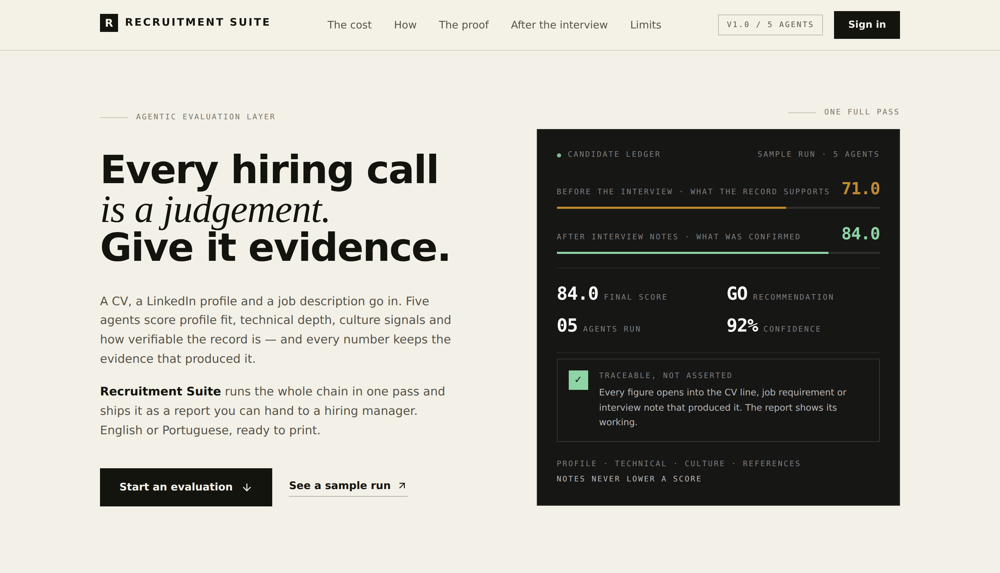

# Recruitment Suite

> Agentic candidate evaluation platform. Upload a CV, add a LinkedIn URL, paste a job description in free text — seven specialized agents (reading the record with [TypeSafe Jev](https://docs.typesafe.ai) when enabled) score the candidate across Profile, Technical Skills, Culture Fit, References, and (optionally) People Analytics, and synthesize a hiring recommendation with a full HTML report in English or Portuguese.

**Stack:** FastAPI (Python) + React/Vite (TypeScript) · SQLAlchemy · Redux Toolkit · Tailwind + Framer Motion · TypeSafe Jev (semantic judgments)
**Deployment:** Vercel (frontend + backend as a single serverless project)
**Live:** https://recruitment-suite.vercel.app



---

## What it does

1. **Agentic analysis** — upload a CV (PDF/DOCX/TXT) and/or a LinkedIn URL, paste a free-text job description. The pipeline extracts CV text, enriches the LinkedIn profile via the [Exa API](https://exa.ai), parses the JD (skills, seniority, years required, languages, urgency, People Analytics detection), and runs the full multi-agent evaluation — all from one form.
2. **Multi-agent scoring** — 6 agents evaluate independently (with `TYPESAFE_API_KEY`, each reads the CV and LinkedIn text through Jev rather than matching keywords), then an orchestrator combines their scores into a weighted final score and a GO / HOLD / NO-GO recommendation with rationale, strengths, gaps, critical flags, next steps, and an onboarding plan.
3. **Post-interview recalculation** — after the interview, add free-text notes. The pipeline re-runs against the CV + notes, and an interview-verification bonus credits skills the interviewer directly confirmed (even if the CV already claimed them) — every score can only rise or hold, never regress below the pre-notes baseline.
4. **Bilingual reports** — every generated evaluation (recommendation text, next steps, onboarding plan, report chrome) is rendered in **English (en-US)** or **Portuguese (pt-BR)**, selected per analysis.
5. **Exportable HTML report** — a full, printable, branded report per evaluation with a score-breakdown accordion (each dimension explains *why* it scored that way), strengths/gaps/critical-flags, a rationale pull-quote, a next-steps/onboarding roadmap, and the post-interview notes. One click prints to PDF via the browser (no server-side PDF dependency) or downloads the raw HTML.
6. **Full CRUD app** — candidates, jobs, and evaluations also have a conventional REST API and a React SPA (Dashboard, Candidates, Jobs, Evaluations, Analyze, Settings) for manual, non-agentic use.

---

## The 7 agents + orchestrator

| Agent | Focus | Score field |
|---|---|---|
| **Orchestrator** | Runs the pipeline, computes the weighted final score, builds the recommendation (rationale, strengths, gaps, flags, next steps, onboarding) | `final_score`, `recommendation_status` |
| **01 · Profile** | Years of experience vs. requirement, education/domain match, career trajectory, language fit | `profile_score` |
| **02 · Technical** | Required/nice-to-have skill coverage matched against CV + LinkedIn text, certifications | `technical_score` |
| **03 · Culture Fit** | Soft-skill signals (leadership, mentoring, collaboration, stakeholder management), job team-context alignment, multilingual proficiency | `culture_score` |
| **04 · References** | Verifiability of the record — LinkedIn/GitHub presence, dated education, certifications (not a live reference call) | `reference_score` |
| **05 · Recommendation** | Synthesizes all scores into the final decision | *(built into orchestrator)* |
| **06 · People Analytics** *(optional, HR/People roles)* | 8 hybrid HR+Tech signal buckets: Employee Listening Platforms, Analytics & Statistics, Organizational Psychology, Survey & Listening Programs, HR Domain Experience, Executive Stakeholder Engagement, Change Management & Transformation, Microsoft Ecosystem (Viva Insights/M365/Copilot/Teams) | `people_analytics_score` |
| **07 · Eligibility** *(not scored)* | Hard constraints stated in the job (location, work model, time zone, right to work, start date, travel, relocation), each marked **Stated** (quoted from the record) or **Confirm** (becomes a next step). Never fails a candidate; nothing inferred from name, nationality or CV language | `eligibility_checks` |

Agent 06 replaces Agent 02 in the weighted formula when a role is detected (or explicitly flagged) as People Analytics/HR.

### Scoring formula

```
Tech roles:            Final = Profile 20% + Technical 35% + Culture 25% + References 15% + Strategic bonus (0-5)
People Analytics roles: Final = Profile 15% + People Analytics 40% + Culture 25% + References 15% + Strategic bonus (0-5)
```

| Final Score | Recommendation |
|---|---|
| 75–100 | ✅ **GO** — proceed to offer |
| 30–74 | 🟡 **HOLD** — manager discussion / more data |
| 0–29 | ❌ **NO-GO** — pass, archive |

### Post-interview recalculation

`POST /api/evaluations/{id}/notes` appends the interview notes to the candidate's CV text and re-runs the whole pipeline. Two safeguards keep it honest:
- **Never regresses**: every dimension is clamped to `max(pre-notes score, recalculated score)`.
- **Interview-verification bonus**: notes that reconfirm a skill/signal the CV *already* claimed still earn credit (up to +12 per dimension) — because a skill demonstrated live to an interviewer is stronger evidence than an unverified CV line. The bonus and the matched terms are shown in the report's per-dimension "why" breakdown.

The very first pre-notes score/status is snapshotted once (`pre_interview_score`/`pre_interview_status`) so the report can always show the before/after delta, no matter how many rounds of notes are added afterward.

### Agent 07 · Eligibility (hard constraints)

Location and work model used to be a fixed 75 inside the Profile score. They are knock-out criteria, not fit, so Agent 07 (`src/agents/agent_07_eligibility.py`) now handles them without scoring:

- **Constraints** come only from the job text, one check per sentence ("Hybrid role based in Manchester" is one check covering work model and location). Offers such as "visa sponsorship provided" are ignored.
- **Stated vs. Confirm**: with TypeSafe, each check is a Noul ("does the record *explicitly* state this?") and counts as stated only at p ≥ 0.8. Without it, a keyword check only marks a constraint as stated when the record says so explicitly, for every part of the sentence. Anything else is **Confirm**.
- **Output**: a report section with ▲ Confirm / ✓ Stated rows, and one "Confirm with the candidate: …" next step per open check. The Profile score now uses its four measured dimensions only (weights renormalised).
- **Fairness**: the agent never infers location, right to work or availability from a name, nationality or the language a CV is written in.

### CV extraction and OCR

- **Text extraction**: PDFs are read with PyMuPDF (layout-aware, one visual line per line), with `pypdf` as a fallback. DOCX, TXT and MD are read directly.
- **Profile fields**: `src/services/cv_sections.py` reads the CV's own **Education**, **Certifications** and **Languages** sections (English and Portuguese headings, bullets and zero-width characters tolerated) and falls back to degree patterns and "Fluent in ..." phrases. Only real human languages count: a toolkit line like `Languages: Python, SQL` is ignored. LinkedIn text fills whatever the CV does not list. The pipeline notes show how many items were read.
- **OCR (opt-in)**: a scanned PDF (almost no text layer) or a PNG / JPG / WEBP upload is transcribed by a vision model through OpenRouter (`src/services/ocr.py`), so no system `tesseract` is needed on Vercel. Set `OPENROUTER_API_KEY` and `OPENROUTER_VISION_MODEL`. Without them the API answers with a clear message instead of an empty score. Page images leave the server for that provider, so enable it only if your data-processing basis covers it. Text PDFs never go through OCR.

### Semantic judgments with TypeSafe Jev (optional, live in production)

With `TYPESAFE_API_KEY` set, the agents read the CV and LinkedIn text through [TypeSafe](https://docs.typesafe.ai) (Jev) instead of matching keywords. Code still owns weights, thresholds and GO / HOLD / NO-GO; TypeSafe only answers narrow, typed questions (`src/services/typesafe_judge.py`).

| Agent | Judgment | Primitive |
|---|---|---|
| 01 · Profile | Career growth, scope vs. target seniority, education relevance | Score (4 levels) |
| 01 · Profile | Each required language evidenced in the record | Noul |
| 02 · Technical | Evidence depth per required / nice-to-have skill: absent → only named → used in a role → owned or delivered results | Score (4 levels) |
| 03 · Culture | Evidence per behavioral theme (buzzword vs. described situation vs. measurable outcome) and fit to team context | Score (4 levels) |
| 04 · References | How checkable the record is; CV vs. LinkedIn contradiction (flagged only at p ≥ 0.8, as "verify") | Score, Noul |
| 06 · People Analytics | Evidence depth per expertise area | Score (4 levels) |

- **Human review routing**: a judgment with confidence < 0.5 becomes a "Verify manually" next step, and each one lowers the evaluation `confidence` by 4 points (capped at 20).
- **Fallback**: with no key, or if the API fails, every agent uses the rule-based scoring above. An evaluation never fails because of TypeSafe.
- **Privacy**: e-mail, phone number and the candidate's name are redacted from the text sent, and every question instructs the model to ignore personal attributes (name, age, gender, nationality). Judge scores still need validation on your own labeled hires before you trust the thresholds.
- **Measured effect** (4 synthetic CVs, same Data Engineer job, same pipeline with and without the key):

  | Candidate | Rule-based | With Jev |
  |---|---|---|
  | A · strong, skills used in depth | 68 | 73 |
  | B · skills only listed, support background | 70 | 57 |
  | C · BI analyst, partial stack | 55 | 55 |
  | D · strong, CV in Portuguese, English implied | 60 | 67 |

  The keyword-stuffed CV no longer outranks the strong one, and working English implied by context is credited. This is a small synthetic check, not a validation: all four still land on HOLD, and thresholds should be calibrated on your own labeled hires.
- **Cost shape**: one request per agent per evaluation (all questions of an agent run in parallel), cached per identical request.

---

## Backend (FastAPI)

```
src/
  agents/         # 6 evaluation agents + orchestrator
  api/
    main.py       # FastAPI app, CORS, /health
    routes/       # candidates, jobs, evaluations, analyze
  cli.py          # click CLI (single/batch evaluation, report generation)
  database/       # SQLAlchemy models + session (SQLite by default)
  generators/     # HTML report generator (Jinja2) + optional PDF (weasyprint, CLI-only)
  models/         # Pydantic domain models (Candidate, Job, Evaluation, Recommendation)
  services/
    cv_parser.py         # Extract text + guess fields from PDF/DOCX/TXT
    linkedin_enricher.py # Exa API profile enrichment
    jd_parser.py          # Free-text JD → structured JobDescription + People Analytics detection
    i18n_service.py       # EN-US / PT-BR translation wrapper (python-i18n)
    interview_boost.py    # Interview-verification scoring bonus
templates/
  report.html.jinja  # The evaluation report (branded, i18n, print-ready)
locales/
  en-US.yml, pt-BR.yml  # All translatable strings (recommendation text, report chrome)
```

### REST API

| Method | Path | Purpose |
|---|---|---|
| `GET` | `/health` | Liveness + safe `EXA_API_KEY` presence check (no secret exposed) |
| `POST` | `/api/analyze/run` | **Agentic pipeline**: CV upload + LinkedIn URL + free-text JD → full evaluation |
| `POST` `GET` `GET /{id}` `PUT /{id}` `DELETE /{id}` | `/api/candidates` | Candidate CRUD |
| `POST` `GET` `GET /{id}` `PUT /{id}` `DELETE /{id}` | `/api/jobs` | Job CRUD |
| `POST` | `/api/evaluations/run` | Run an evaluation for an existing candidate + job (manual flow) |
| `GET` | `/api/evaluations/{id}` | Evaluation detail (scores, rationale, strengths/gaps/flags) |
| `POST` | `/api/evaluations/{id}/notes` | Add post-interview notes and recalculate |
| `GET` | `/api/evaluations/{id}/report` | Full branded HTML report (printable to PDF) |
| `GET` | `/api/evaluations` | List, filterable by `candidate_id` / `job_id` |
| `GET` | `/api/evaluations/candidate/{id}/history` | All evaluations for a candidate |
| `GET` | `/api/evaluations/job/{id}/results` | All evaluations for a job, ranked by score |

All evaluation/analyze endpoints accept a `language` field (`en-US` default, or `pt-BR`) that controls the language of every generated string and the report.

### CLI (`python -m src.cli`)

```
evaluate    --candidate-file <json> --job-file <json> [--playbook quick-screen|full-evaluation|full-people-analytics] [--output-dir reports]
batch       --candidates-file <json> --job-file <json> [--output-dir reports] [--format html|json]
version
```

### Configuration (`.env`)

| Variable | Purpose |
|---|---|
| `DATABASE_URL` | SQLite by default (`sqlite:///./recruitment_suite.db`); **on Vercel serverless this falls back to an ephemeral `/tmp` file that resets on cold start** — set a persistent Postgres URL (Vercel Postgres/Neon/Supabase) for production durability |
| `EXA_API_KEY` | Required for LinkedIn enrichment in `/api/analyze/run`; degrades gracefully (uses CV only) if missing |
| `OPENROUTER_VISION_MODEL` | Optional. Any OpenRouter model that accepts images; enables OCR for scanned PDFs and image CVs (needs `OPENROUTER_API_KEY`) |
| `TYPESAFE_API_KEY`, `TYPESAFE_MODEL` | Optional. Enables TypeSafe semantic judgments (see above); key from https://console.typesafe.ai/, model defaults to `jev-latest`. Server-side only, never a `VITE_*` variable |
| `SQL_ECHO`, `API_HOST`, `API_PORT`, `CORS_ORIGINS` | Standard FastAPI/dev server tuning |

---

## Frontend (React + Vite + TypeScript)

```
frontend/src/
  pages/
    LandingPage.tsx              # Public marketing page (unauthenticated)
    LoginPage.tsx                # Mock auth (demo: any email/password)
    DashboardPage.tsx            # KPI overview
    AnalyzePage.tsx              # Agentic pipeline UI: CV drop-zone, LinkedIn URL, JD textarea, EN-US/PT-BR toggle
    SettingsPage.tsx
    candidates/ jobs/ evaluations/  # Conventional CRUD list/detail/form pages
  components/
    layouts/       # MainLayout (sidebar+navbar), AuthLayout
    common/        # Navbar, Sidebar
    motion/        # Framer Motion primitives (Page transitions, AnimatedNumber, ScoreBar, LiftCard)
  store/           # Redux Toolkit slices (auth, candidates, jobs, evaluations, ui)
  services/api.ts  # Axios client, same-origin in production
```

Same-origin API calls in production (Vercel rewrites `/api/*` to the serverless function); `VITE_API_URL` overrides for local dev against `localhost:8000`.

---

## Deployment (Vercel)

Single Vercel project serves both halves:
- **Frontend**: Vite build → static, served from `frontend/dist`
- **Backend**: `api/index.py` exposes the FastAPI app as an ASGI serverless function; `vercel.json` rewrites `/api/*` and `/health` to it, everything else falls through to the SPA

Required environment variable in the Vercel dashboard: `EXA_API_KEY` (Production + Preview). Without it, LinkedIn-only analysis fails with an actionable 502 explaining the missing key; CV-only analysis still works.

Alternative self-hosting paths are included for a persistent backend: `Dockerfile` and `render.yaml` (Render.com).

⚠️ **Known limitation**: the default SQLite database is ephemeral on Vercel serverless (`/tmp`, wiped on cold start). Evaluations can disappear between sessions. For production durability, point `DATABASE_URL` at a persistent Postgres instance.

---

## Local development

```bash
# Backend
pip install -r requirements.txt
cp .env.example .env   # fill in EXA_API_KEY if you want LinkedIn enrichment
uvicorn src.api:app --reload --port 8000

# Frontend
cd frontend
npm install
npm run dev             # http://localhost:5173, proxies to localhost:8000
```

### Tests

```bash
pytest tests/ -q                                        # API, agents, i18n, interview notes
cd frontend && npx tsc --noEmit -p tsconfig.app.json     # type-check
```

---

## Design principles

- **No LLM calls in the agents** — every score is a deterministic, explainable heuristic (keyword/skill matching, weighted formulas), so the same input always produces the same output and every number has a traceable "why."
- **Graceful degradation** — a missing LinkedIn key, missing CV, or missing JD fields never crash the pipeline; they show up as gaps/flags instead.
- **i18n as a first-class concern** — all agent-generated text and report chrome route through `src/services/i18n_service.py` / `locales/*.yml`, not hardcoded strings.
- **Reversible, additive interview feedback** — post-interview notes can only improve a candidate's score, never penalize them, matching how a real interview should be treated as additional evidence.

---

**Status:** Live on Vercel.
